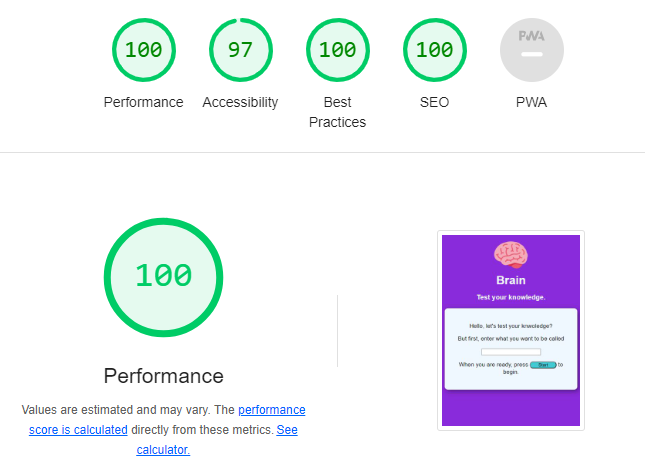

# Brain - Game

[Brain-Live Page](https://celomarcelo.github.io/brain-project/)

The Brain game was created with the aim of testing the user's knowledge, bringing some different facts about history, events, music, etc..., and also awakening the user's curiosity towards the content shown.
The game consists of a number of questions that can be either true or false, if false, the correct answer is shown.
At the end, the user receives a score.

## Features 

### Existing Features

- __Name/nickname field__

 - Designated for the user to enter what they would like to be called, at the end of the game the entered value and the game score are displayed.
   

- If there is no text, the page displays a message.

- __Questions and answers area.__

  - The second part of the game shows the current question, the answer and submission options

  - If the option selected by the user is "false", it displays the correct answer.

  - If there is no option selected, the page displays a message.

  - The last section informs the user of their score and whether they would like to restart the game.

### Features Left to Implement

- Questions according to subjects.
- User score history

## Technologies used

- VS Code
- GitHub
- GitHub Desktop
- Node JS
- JavaScript
- HTML 5
- CSS 3

## Testing 

### Validator Testing 

- HTML
  - No errors were returned when passing through the officia
[W3C validator](https://validator.w3.org)

   
- CSS
  - No errors were found when passing through the official
  
[(Jigsaw) validator](https://jigsaw.w3.org)

- JavaScript
  - JSHint is showing 5 unused variables but these variables are being called through "onclick" in the HTML document.

   
### Check List
- A feature checklist was created to ensure all testing.

| function        | behavior                  | pass/fail |
|-----------------|---------------------------|---------- |
| load page       | right layout              | pass      |
| text box        | receive value             | pass      |
| no text value   | show message              | pass      |
| question space  | display quest.            | pass      |
| answer place    | display options           | pass      |
| true option     | receive value             | pass      |
| false option    | receive value             | pass      |
| submit button   | check user ans.           | pass      |
|if correct       | display correct           | pass      |
|if incorrect     | display correct answer    | pass      |
|next question    | goes to next question     | pass      |
|no answer option | display screen message    | pass      |
|Functions checked for all questions         || pass      |
|finish           | goes to result            | pass      |
|show user name   | display username value    | pass      |
|restart button   | restart game, reset values| pass      |

### Lighthouse tests was carried out to ensure performance

## Deployment

- The site was deployed to GitHub pages. The steps to deploy are as follows: 
  - In the GitHub repository, navigate to the Settings tab 
  - From the source section drop-down menu, select the Master Branch
  - Once the master branch has been selected, the page will be automatically refreshed with a detailed ribbon display to indicate the successful deployment. 

The live link can be found here - https://github.com/Celomarcelo/brain-project 

## Credits 

### Content 
 
- The text content was extracted from the following pages:
 - Wikipedia
- The icon was taken from 
[Favicon](https://favicon.io)
